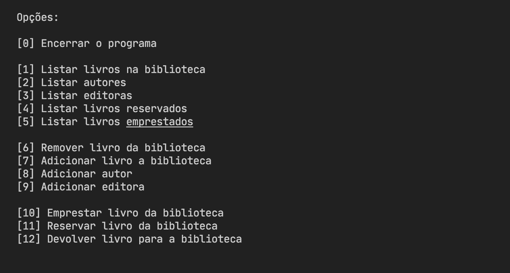

# Sistema de gerênciamente de biblioteca

Este é um sistema de gerênciamento de biblioteca com interface cli e persistência local, desenvolvido para avaliação na disciplina Projeto de Programas.



## Execução

O programa pode ser compilado e executado por meio de uma IDE como o intelliJ, Eclipse ou VS Code. (Utilizar o Java 17)

Você também utilizar o `javac` para compilar o programga:
```shell
$ javac Main.java
```
E utilizar o comando `java` para executar o programa `.class`:
```shell
$ java Main
```